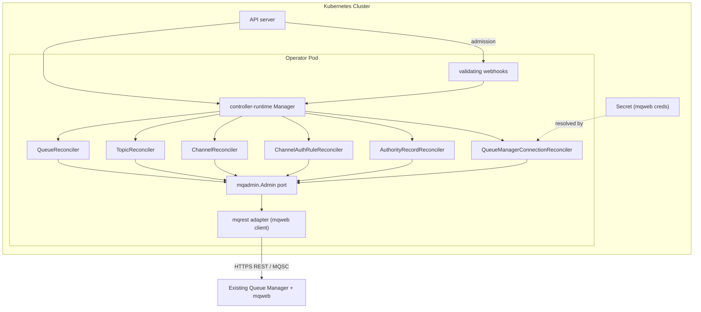
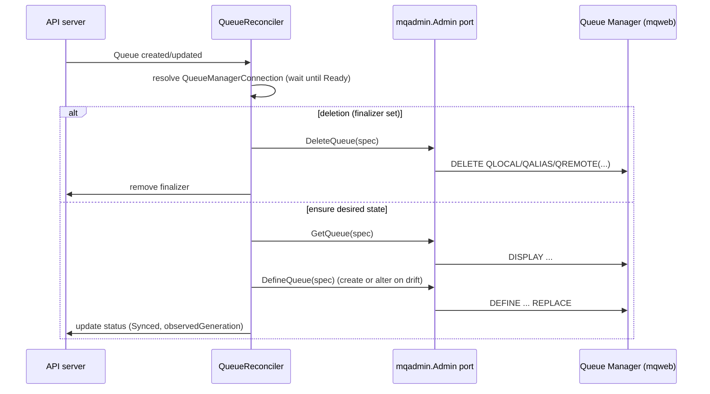
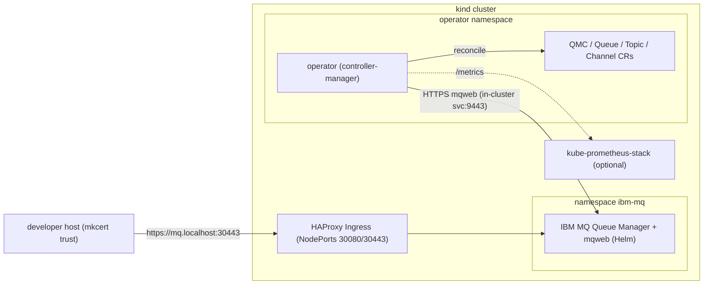

# Architecture

This document describes the design of **Kurator**: its
components, the custom resources it manages, the reconcile flow, and the local
development topology. For conventions and tooling see [DEVELOPMENT.md](DEVELOPMENT.md); for the delivery
plan see [ROADMAP.md](ROADMAP.md). Attribute DEFINE vs drift behaviour:
[ATTRIBUTE_RECONCILIATION.md](ATTRIBUTE_RECONCILIATION.md) ([ADR-0010](adr/0010-drift-based-mq-reconciliation.md)).

**See also**

| Doc | Focus |
|-----|--------|
| [GO_MODULE.md](GO_MODULE.md) | Go module path, package layers, generated artifacts, testing pyramid |
| [OPERATOR_RUNTIME.md](OPERATOR_RUNTIME.md) | Manager startup, reconcilers, connection cache, webhooks vs reconcile, errors |

## Scope

The operator manages **administrative objects on an existing IBM MQ Queue
Manager** declaratively. It is explicitly **not** responsible for deploying or
operating Queue Manager installations. The Queue Manager already exists and
exposes the IBM MQ Administrative REST API (`mqweb`). See
[ADR-0012](adr/0012-operator-scope-existing-queue-manager.md).

The initial `v1alpha1` API targets:

- `QueueManagerConnection` — how to reach a Queue Manager (endpoint + creds).
- `Queue`, `Topic`, `Channel` — MQSC objects on a referenced Queue Manager.

## Components



| Component | Responsibility |
|-----------|----------------|
| **Manager** (`cmd/`) | Wires reconcilers, validating webhooks, caches, health/metrics, leader election. |
| **Validating webhooks** (`internal/webhook`, `internal/validation`) | Reject invalid CR specs at admission (`failurePolicy: Fail`); same-namespace `connectionRef` and Secret checks; deny `QueueManagerConnection` **delete** when dependent CRs exist — **no mqweb**. ([ADR-0009](adr/0009-validating-admission-webhooks.md)) |
| **Reconcilers** (`internal/controller`) | Thin control loops for `QueueManagerConnection`, `Queue`, `Topic`, `Channel`, `ChannelAuthRule`, and `AuthorityRecord`. Translate desired vs. observed state and call the `mqadmin.Admin` port. No HTTP/MQ details. See [OPERATOR_RUNTIME.md](OPERATOR_RUNTIME.md). |
| **MQAdmin port** (`internal/mqadmin`) | Go interface (`Admin`) describing MQ operations (ping, queue/topic/channel define/inspect/delete) plus domain types. The seam that makes controllers testable and backends swappable. |
| **mqrest adapter** (`internal/adapter/mqrest`) | The only `MQAdmin` implementation today. Talks to `mqweb` over HTTPS, posting MQSC commands and parsing responses. |
| **Secret** | Holds mqweb credentials (and optionally TLS material), referenced by `QueueManagerConnection`. Never inlined in specs. |

### The MQAdmin port

The live interface in `internal/mqadmin/admin.go` (abbreviated):

```go
// Admin is the seam between reconcilers and IBM MQ.
type Admin interface {
    Ping(ctx context.Context) error
    GetQueue(ctx context.Context, spec QueueSpec) (*QueueState, error)
    DefineQueue(ctx context.Context, spec QueueSpec) error
    DeleteQueue(ctx context.Context, spec QueueSpec) error
    GetTopic(ctx context.Context, name string) (*TopicState, error)
    DefineTopic(ctx context.Context, spec TopicSpec) error
    DeleteTopic(ctx context.Context, name string) error
    GetChannel(ctx context.Context, spec ChannelSpec) (*ChannelState, error)
    DefineChannel(ctx context.Context, spec ChannelSpec) error
    DeleteChannel(ctx context.Context, spec ChannelSpec) error
    SetChannelAuth(ctx context.Context, spec ChannelAuthSpec) error
    GetChannelAuth(ctx context.Context, spec ChannelAuthSpec) (*ChannelAuthState, error)
    DeleteChannelAuth(ctx context.Context, spec ChannelAuthSpec) error
    SetAuthority(ctx context.Context, spec AuthoritySpec) error
    GetAuthority(ctx context.Context, spec AuthoritySpec) (*AuthorityState, error)
    DeleteAuthority(ctx context.Context, spec AuthoritySpec) error
}
```

- Reconcilers depend only on this interface.
- `mockery` generates a mock from it for unit tests (`test/mocks`).
- A future PCF backend can implement the same interface with no controller
  changes (see [ADR-0002](adr/0002-manage-mq-via-mqweb-rest.md)).

## Operator runtime concerns

The `cmd/` entrypoint wires a single controller-runtime **Manager** (startup,
reconciler registration, webhooks, connection cache, per-CR reconcile loops,
finalizers, Events, and error/requeue behaviour are documented in
[OPERATOR_RUNTIME.md](OPERATOR_RUNTIME.md)). Cross-cutting NFRs:
[NON_FUNCTIONAL_REQUIREMENTS.md](NON_FUNCTIONAL_REQUIREMENTS.md).

| Concern | Approach |
|---------|----------|
| **Leader election** | `--leader-elect`; `Lease` in operator namespace. |
| **Health / readiness** | `healthz` ping; `readyz` requires zero QMCs or at least one `Ready=True` (`internal/health`). |
| **Metrics** | HTTPS metrics on `:8443` (authn/authz) plus custom reconcile metrics; optional `ServiceMonitor`. |
| **Graceful shutdown** | `SIGTERM`/`SIGINT`; in-flight work drains within pod grace period. |
| **Configuration** | Flags/env for probes, metrics, leader election, logging, concurrency — not MQ endpoints. |
| **Logging** | [LOGGING.md](LOGGING.md), [ADR-0007](adr/0007-structured-logging-logr-slog.md). |
| **Concurrency** | `MaxConcurrentReconciles` shared across all Kurator controllers. |

### RBAC & least privilege

The operator ships a tightly scoped `ClusterRole` generated from
`+kubebuilder:rbac` markers:

- Full access to its own API group (`messaging.kurator.dev`): `queues`,
  `topics`, `channels`, `channelauthrules`, `authorityrecords`,
  `queuemanagerconnections`, and their `/status` and `/finalizers` subresources.
- `get`/`list`/`watch` on the referenced **`Secrets`** (credentials, CA bundles)
  — and nothing broader on core resources.
- `create`/`patch` on `Events`; reconcilers emit Kubernetes Events on **condition
  transitions** (Normal) and **terminal failures** (Warning) in addition to status
  conditions. Transient MQ/network errors update status only — no Events — to
  avoid noise during retries. See [Event emission](#event-emission) below.
- `Lease` access in the operator namespace for leader election.

No wildcard verbs, no cluster-admin. RBAC drift is caught by `task verify`.

### Connection, events, and errors

Connection client caching, Kubernetes Event rules, and the terminal/transient/not-found
error taxonomy are covered in [OPERATOR_RUNTIME.md](OPERATOR_RUNTIME.md) (with
[ADR-0014](adr/0014-mq-error-taxonomy-and-requeue.md) and
[ADR-0015](adr/0015-kubernetes-events-on-transitions.md)). mqweb TLS and CSRF:
[IBM_MQ_REST_API.md](IBM_MQ_REST_API.md).

## Security model

- **No inline credentials**: all secrets come from referenced `Secret`s; specs
  never carry passwords or keys.
- **Least-privilege RBAC** as above; the operator can read only the Secrets it
  needs.
- **TLS everywhere**: HTTPS to mqweb with verification on by default; custom CA
  bundles via `caSecretRef`.
- **Defense in logging**: structured logs scrub credentials; request/response
  bodies are not logged at default levels.
- **Supply chain**: CGO-free static binary, distroless nonroot image,
  `govulncheck` + image scanning in CI (see [CICD.md](CICD.md),
  [ADR-0016](adr/0016-release-supply-chain.md)).

Full requirements and rationale: [NON_FUNCTIONAL_REQUIREMENTS.md](NON_FUNCTIONAL_REQUIREMENTS.md).

## Custom resources

### QueueManagerConnection

Describes how to reach a Queue Manager. **Namespaced** (all v1alpha1 CRDs) for
multi-tenant isolation.

```yaml
apiVersion: messaging.kurator.dev/v1alpha1
kind: QueueManagerConnection
metadata:
  name: qm1
spec:
  queueManager: QM1            # MQ Queue Manager name
  endpoint: https://mq.example.com:9443
  tls:
    insecureSkipVerify: false
    caSecretRef:               # optional CA bundle
      name: qm1-ca
  credentialsSecretRef:        # username/password for mqweb
    name: qm1-mqweb
status:
  conditions:                  # Ready=True once Ping succeeds
    - type: Ready
      status: "True"
```

### Queue

A queue maintained on a referenced Queue Manager (`QLOCAL`, `QALIAS`, or
`QREMOTE`).

```yaml
apiVersion: messaging.kurator.dev/v1alpha1
kind: Queue
metadata:
  name: orders
spec:
  connectionRef:
    name: qm1                  # references a QueueManagerConnection
  queueName: APP.ORDERS        # MQ object name
  type: local                  # local | alias | remote
  attributes:                  # lowercase MQSC keys
    maxdepth: "5000"
    descr: "Orders intake queue"
status:
  conditions:                  # Synced=True when MQSC matches spec
    - type: Synced
      status: "True"
  observedGeneration: 3
```

### Topic

An administrative topic object (`DEFINE TOPIC`) on a referenced Queue Manager.

```yaml
apiVersion: messaging.kurator.dev/v1alpha1
kind: Topic
metadata:
  name: retail-orders
spec:
  connectionRef:
    name: qm1
  topicName: RETAIL.ORDERS
  attributes:
    topstr: retail/orders
    descr: Retail order events
status:
  conditions:
    - type: Synced
      status: "True"
```

### Channel

A server-connection channel (`CHLTYPE(SVRCONN)`) on a referenced Queue Manager.

```yaml
apiVersion: messaging.kurator.dev/v1alpha1
kind: Channel
metadata:
  name: orders-app
spec:
  connectionRef:
    name: qm1
  channelName: ORDERS.APP
  type: svrconn
  attributes:
    descr: Application SVRCONN channel
    trptype: tcp
status:
  conditions:
    - type: Synced
      status: "True"
```

Design choices (Queue, Topic, Channel):

- `connectionRef` decouples object definitions from connection details and lets
  many resources share one connection.
- `attributes` map to MQSC parameters (lowercase keys) so new attributes can be
  supported without API churn. Drift-checked vs define-only keys are documented
  in [ATTRIBUTE_RECONCILIATION.md](ATTRIBUTE_RECONCILIATION.md).

## Reconcile flow

`Queue`, `Topic`, `Channel`, `ChannelAuthRule`, and `AuthorityRecord` reconcilers
share the same lifecycle pattern (connection wait → finalizer → ensure/delete via
`mqadmin.Admin`). Full flowchart and per-kind notes:
[OPERATOR_RUNTIME.md](OPERATOR_RUNTIME.md#reconcile-flow-workload-crs). Example
for a `Queue`:



Other workload kinds call the corresponding `Admin` methods (`DefineTopic`,
`SetChannelAuth`, `SetAuthority`, etc.) with the same ensure/delete structure.

Principles:

- **Idempotent**: define/alter MQSC so repeated reconciles converge; safe to
  re-run.
- **Drift detection**: compare observed MQSC attributes against spec each loop
  and correct (see [ATTRIBUTE_RECONCILIATION.md](ATTRIBUTE_RECONCILIATION.md)).
- **Finalizers**: a finalizer guarantees the MQ object is removed before the CR
  disappears.
- **Status conditions**: `Ready` on `QueueManagerConnection` (connectivity) and
  `Synced` on workload CRs (object matches spec), plus `observedGeneration`,
  give clear, machine-readable state.

## Why REST over PCF

| Aspect | mqweb REST (chosen) | PCF via `ibm-messaging/mq-golang` |
|--------|--------------------|-----------------------------------|
| Build | Pure Go, `CGO_ENABLED=0` | Requires MQ C client libs + CGO |
| Image | Slim, static binary | Must bundle native MQ client |
| Testability | Easy: `httptest` + mockable port | Harder: native client, command queues |
| Transport | HTTPS, firewall-friendly | MQ channels |

REST keeps the binary pure Go and the project easy to test and ship. The
`MQAdmin` port preserves the option to add a PCF adapter later if a deployment
requires it, without disturbing controllers. The full rationale and trade-offs
are recorded in [ADR-0002](adr/0002-manage-mq-via-mqweb-rest.md).

## Local development topology

Day-to-day development and e2e run against a self-contained local platform under
`hack/kind-cluster`: a **kind** cluster with **HAProxy Ingress** (NodePorts
30080/30443), **cert-manager**, an optional **kube-prometheus-stack**, and a
real **IBM MQ** Queue Manager (Helm chart) — all provisioned with **Terraform**.
mkcert provides trusted TLS for `*.localhost`, so the web console and REST API
are reachable over real HTTPS without `curl -k`. See
[DEVELOPMENT.md](DEVELOPMENT.md) for commands.



- **kind** hosts both day-to-day dev and e2e runs; Terraform provisions HAProxy
  ingress, TLS, monitoring, and the Queue Manager.
- The operator reaches mqweb in-cluster (e.g. `https://ibm-mq.ibm-mq.svc:9443`);
  humans reach the console/REST via ingress at `https://mq.localhost:30443`.
- e2e (`KURATOR_E2E_MQ=1`) asserts that applying workload and auth CRs produces
  the expected MQSC objects on the live Queue Manager.
- Unit/envtest layers need no MQ at all (port is mocked), keeping the inner loop
  fast.
