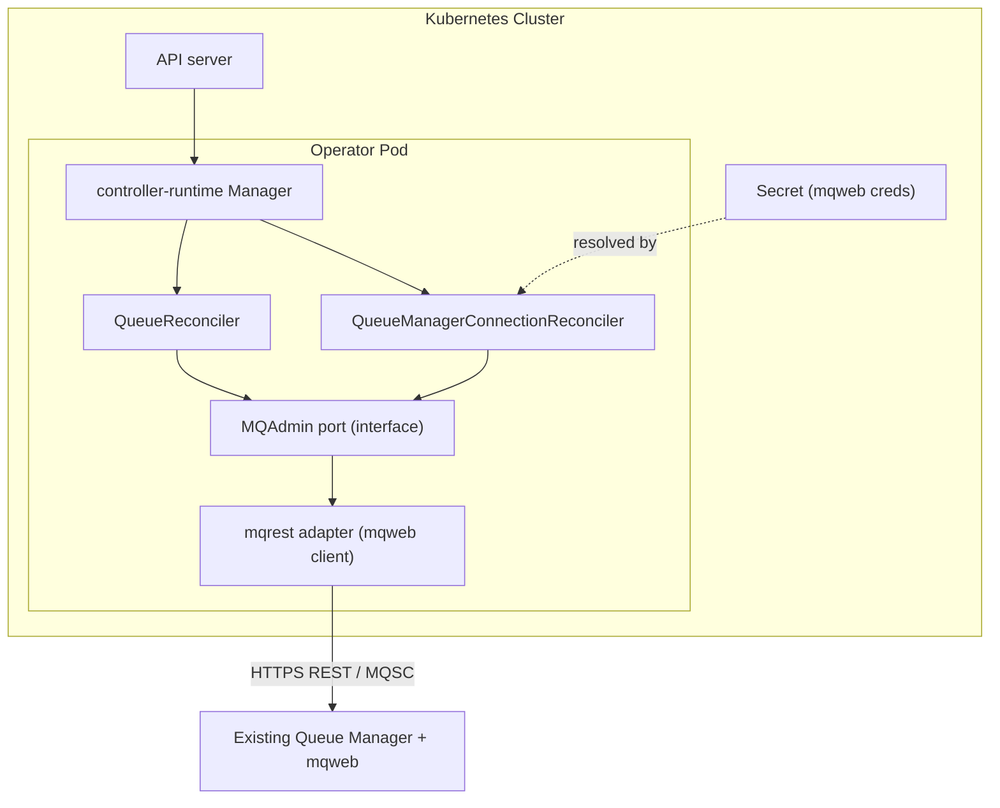
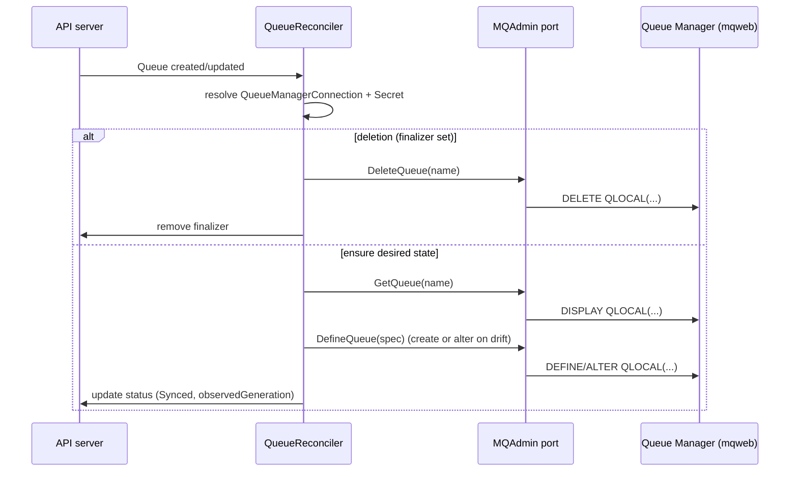
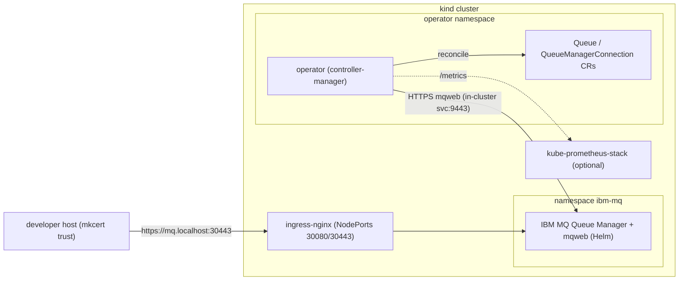

# Architecture

This document describes the design of the IBM Message Queue Operator: its
components, the custom resources it manages, the reconcile flow, and the local
development topology. For conventions and tooling see
[../AGENTS.md](../AGENTS.md); for the delivery plan see [ROADMAP.md](ROADMAP.md).

## Scope

The operator manages **administrative objects on an existing IBM MQ Queue
Manager** declaratively. It is explicitly **not** responsible for deploying or
operating Queue Manager installations. The Queue Manager already exists and
exposes the IBM MQ Administrative REST API (`mqweb`).

The initial `v1alpha1` API targets two resources:

- `QueueManagerConnection` — how to reach a Queue Manager (endpoint + creds).
- `Queue` — a queue to maintain on a referenced Queue Manager.

## Components



| Component | Responsibility |
|-----------|----------------|
| **Manager** (`cmd/`) | Wires reconcilers, caches, health/metrics, leader election. |
| **Reconcilers** (`internal/controller`) | Thin control loops. Translate desired vs. observed state and call the `MQAdmin` port. No HTTP/MQ details. |
| **MQAdmin port** (`internal/mqadmin`) | Go interface describing MQ operations (define/inspect/delete queue, ping connection, etc.) plus domain types. The seam that makes controllers testable and backends swappable. |
| **mqrest adapter** (`internal/adapter/mqrest`) | The only `MQAdmin` implementation today. Talks to `mqweb` over HTTPS, posting MQSC commands and parsing responses. |
| **Secret** | Holds mqweb credentials (and optionally TLS material), referenced by `QueueManagerConnection`. Never inlined in specs. |

### The MQAdmin port

A representative shape (final signatures land in Phase 2):

```go
// MQAdmin is the seam between reconcilers and IBM MQ.
type MQAdmin interface {
    Ping(ctx context.Context) error
    GetQueue(ctx context.Context, name string) (*QueueState, error)
    DefineQueue(ctx context.Context, spec QueueSpec) error
    DeleteQueue(ctx context.Context, name string) error
}
```

- Reconcilers depend only on this interface.
- `mockery` generates a mock from it for unit tests (`test/mocks`).
- A future PCF backend can implement the same interface with no controller
  changes (see [ADR-0002](adr/0002-manage-mq-via-mqweb-rest.md)).

## Operator runtime concerns

The `cmd/` entrypoint wires a single controller-runtime **Manager** that owns
all cross-cutting runtime behaviour. These are first-class requirements, not
afterthoughts (NFRs in [NON_FUNCTIONAL_REQUIREMENTS.md](NON_FUNCTIONAL_REQUIREMENTS.md)).

| Concern | Approach |
|---------|----------|
| **Leader election** | Enabled (`--leader-elect`) so a multi-replica Deployment has exactly one active reconciler; standby replicas give fast failover. Uses a `Lease` in the operator namespace. |
| **Health / readiness** | `healthz` and `readyz` on `:8081`; wired to Deployment liveness/readiness probes. Readiness gates on manager cache sync. |
| **Metrics** | controller-runtime Prometheus metrics on `:8443` (HTTPS, authn/authz-protected) plus custom MQ counters/histograms. A `ServiceMonitor` is shipped (optional) for the local kube-prometheus-stack. |
| **Graceful shutdown** | Manager stops on `SIGTERM`/`SIGINT`, draining in-flight reconciles within `terminationGracePeriodSeconds`. |
| **Configuration** | Flags + env for metrics/health addresses, leader election, log level/format, and reconcile concurrency. No MQ endpoints in operator config — those live in `QueueManagerConnection` CRs. |
| **Logging** | Structured logging via `logr`/`zap`; one logger per reconcile keyed by object. Never log secrets or full credentialed request bodies. |
| **Concurrency** | `MaxConcurrentReconciles` tuned per controller; work is queued and rate-limited by controller-runtime. |

### RBAC & least privilege

The operator ships a tightly scoped `ClusterRole` generated from
`+kubebuilder:rbac` markers:

- Full access to its own API group (`messaging.heimel.dev`): `queues`,
  `queuemanagerconnections`, and their `/status` and `/finalizers` subresources.
- `get`/`list`/`watch` on the referenced **`Secrets`** (credentials, CA bundles)
  — and nothing broader on core resources.
- `create`/`patch` on `Events` for surfacing reconcile outcomes.
- `Lease` access in the operator namespace for leader election.

No wildcard verbs, no cluster-admin. RBAC drift is caught by `task verify`.

### Connection & client lifecycle

- A `QueueManagerConnection` resolves to an `MQAdmin` client: endpoint + TLS
  trust (from `caSecretRef`) + credentials (from `credentialsSecretRef`).
- The adapter keeps a **pooled HTTPS client** per connection (reused across
  reconciles) rather than dialing per request; clients are rebuilt when the
  connection spec or referenced `Secret` changes.
- TLS is verified by default; `insecureSkipVerify` is opt-in and intended only
  for local dev. The mqweb CSRF header (`ibm-mq-rest-csrf-token`) is sent on all
  mutating calls (see [IBM_MQ_REST_API.md](IBM_MQ_REST_API.md)).

### Error handling & requeue strategy

Errors are classified at the `MQAdmin` port boundary so controllers can react
without string-parsing:

| Class | Examples | Reconciler response |
|-------|----------|---------------------|
| **Terminal** | invalid MQSC, 400/403, auth misconfig | Set a failing condition with a clear reason; do **not** hot-loop. Surface via status + Event; wait for spec/Secret change. |
| **Transient** | 5xx, network timeout, QM not running (503) | Return the error (or `RequeueAfter` with backoff) so controller-runtime retries with rate limiting. |
| **NotFound** | object absent on QM | Treated as "needs create" on ensure, or "already gone" on delete. |

Principles: wrap with `%w` and context; use `errors.Is`/`errors.As`; let
controller-runtime own backoff for transient failures; never panic in a
reconcile.

## Security model

- **No inline credentials**: all secrets come from referenced `Secret`s; specs
  never carry passwords or keys.
- **Least-privilege RBAC** as above; the operator can read only the Secrets it
  needs.
- **TLS everywhere**: HTTPS to mqweb with verification on by default; custom CA
  bundles via `caSecretRef`.
- **Defense in logging**: structured logs scrub credentials; request/response
  bodies are not logged at default levels.
- **Supply chain**: CGO-free static binary, distroless nonroot image,
  `govulncheck` + image scanning in CI (see [CICD.md](CICD.md)).

Full requirements and rationale: [NON_FUNCTIONAL_REQUIREMENTS.md](NON_FUNCTIONAL_REQUIREMENTS.md).

## Custom resources

### QueueManagerConnection

Describes how to reach a Queue Manager. Cluster- or namespace-scoped (TBD in
Phase 2; namespaced by default for multi-tenant isolation).

```yaml
apiVersion: messaging.heimel.dev/v1alpha1
kind: QueueManagerConnection
metadata:
  name: qm1
spec:
  queueManager: QM1            # MQ Queue Manager name
  endpoint: https://mq.example.com:9443
  tls:
    insecureSkipVerify: false
    caSecretRef:               # optional CA bundle
      name: qm1-ca
  credentialsSecretRef:        # username/password for mqweb
    name: qm1-mqweb
status:
  conditions:                  # Ready=True once Ping succeeds
    - type: Ready
      status: "True"
```

### Queue

A queue maintained on a referenced Queue Manager.

```yaml
apiVersion: messaging.heimel.dev/v1alpha1
kind: Queue
metadata:
  name: orders
spec:
  connectionRef:
    name: qm1                  # references a QueueManagerConnection
  queueName: APP.ORDERS        # MQ object name
  type: local                  # local | alias | remote (start with local)
  attributes:                  # MQSC attributes, e.g. MAXDEPTH
    maxDepth: 5000
    description: "Orders intake queue"
status:
  conditions:                  # Synced=True when MQSC matches spec
    - type: Synced
      status: "True"
  observedGeneration: 3
```

Design choices:

- `connectionRef` decouples queue definitions from connection details and lets
  many queues share one connection.
- `attributes` map to MQSC attributes so new attributes can be supported
  without API churn; a curated, validated subset is promoted to typed fields
  over time.

## Reconcile flow



Principles:

- **Idempotent**: define/alter MQSC so repeated reconciles converge; safe to
  re-run.
- **Drift detection**: compare observed MQSC attributes against spec each loop
  and correct.
- **Finalizers**: a finalizer guarantees the MQ object is removed before the CR
  disappears.
- **Status conditions**: `Ready` (connection reachable) and `Synced` (object
  matches spec), plus `observedGeneration`, give clear, machine-readable state.

## Why REST over PCF

| Aspect | mqweb REST (chosen) | PCF via `ibm-messaging/mq-golang` |
|--------|--------------------|-----------------------------------|
| Build | Pure Go, `CGO_ENABLED=0` | Requires MQ C client libs + CGO |
| Image | Slim, static binary | Must bundle native MQ client |
| Testability | Easy: `httptest` + mockable port | Harder: native client, command queues |
| Transport | HTTPS, firewall-friendly | MQ channels |

REST keeps the binary pure Go and the project easy to test and ship. The
`MQAdmin` port preserves the option to add a PCF adapter later if a deployment
requires it, without disturbing controllers. The full rationale and trade-offs
are recorded in [ADR-0002](adr/0002-manage-mq-via-mqweb-rest.md).

## Local development topology

Day-to-day development and e2e run against a self-contained local platform under
`hack/kind-cluster`: a **kind** cluster with **ingress-nginx**, **cert-manager**,
an optional **kube-prometheus-stack**, and a real **IBM MQ** Queue Manager
(Helm chart) — all provisioned with **Terraform**. mkcert provides trusted TLS
for `*.localhost`, so the web console and REST API are reachable over real HTTPS
without `curl -k`. See [DEVELOPMENT.md](DEVELOPMENT.md) for commands.



- **kind** hosts both day-to-day dev and e2e runs; Terraform provisions ingress,
  TLS, monitoring, and the Queue Manager.
- The operator reaches mqweb in-cluster (e.g. `https://ibm-mq.ibm-mq.svc:9443`);
  humans reach the console/REST via ingress at `https://mq.localhost:30443`.
- e2e asserts that applying CRs produces the expected MQSC objects on the live
  Queue Manager.
- Unit/envtest layers need no MQ at all (port is mocked), keeping the inner loop
  fast.
