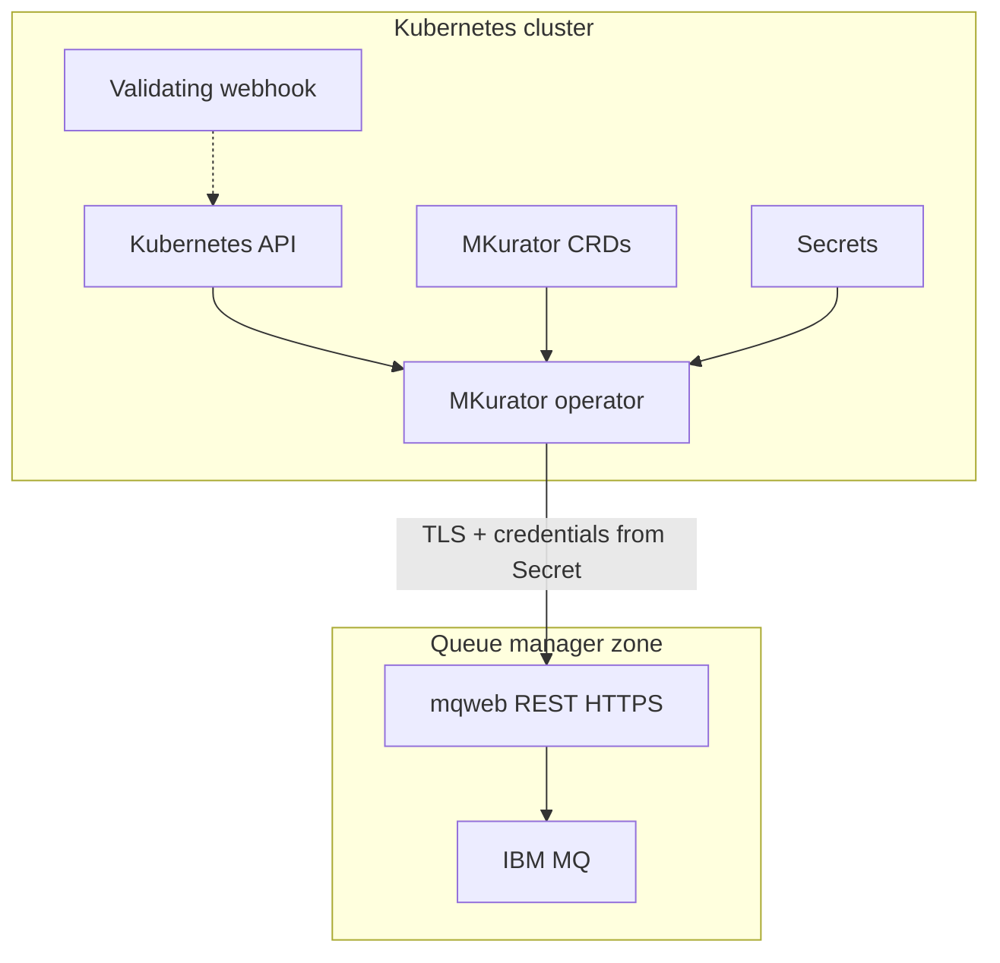

# Security assurance case

Security claims, trust boundaries, and countermeasures for MKurator. Complements
[NFR SEC-*](../NON_FUNCTIONAL_REQUIREMENTS.md#1-security), [SECURITY.md](../SECURITY.md),
and [ADR-0009](../adr/0009-validating-admission-webhooks.md).

**Last updated:** 2026-06-06

## Claims and scope

MKurator is a Kubernetes operator that manages IBM MQ administrative objects via mqweb HTTPS.
It runs with cluster credentials, holds references to MQ credentials in Secrets, and must not
leak secrets or exceed RBAC.

| ID | Requirement | Primary enforcement |
| --- | --- | --- |
| SEC-1 | No credentials in CR specs, code, images, or logs | NFR doc, gosec, gitleaks |
| SEC-2 | TLS verify on for mqweb; insecure opt-in only | mqrest adapter, NFR SEC-2 |
| SEC-3 | Least-privilege operator RBAC | `config/rbac/`, `task audit:rbac` |
| SEC-4 | Distroless nonroot runtime | Dockerfile, Pod securityContext |
| SEC-6 | No known critical/high vulns at release | govulncheck, Trivy release gate |

## Trust boundaries

| Boundary | Trust assumption | Controls |
| --- | --- | --- |
| **Operator ↔ Kubernetes API** | Apiserver authentic; RBAC correct | Scoped ClusterRole; namespace-bound Secret refs |
| **Operator ↔ Secrets** | Secret readable only where RBAC allows | `credentialsSecretRef` / `caSecretRef` only |
| **Operator ↔ mqweb** | Network may be hostile | TLS verify default; custom CA; dev-only insecure skip |
| **Admission ↔ API writers** | Webhook pod availability | `failurePolicy: Fail`; CEL migration planned |
| **Supply chain ↔ Adopter** | Registry/releases may be tampered | cosign, SBOM, SLSA attestations ([ADR-0016](../adr/0016-release-supply-chain.md)) |

## Threats and countermeasures

| Threat | Impact | Countermeasure | Verification |
| --- | --- | --- | --- |
| Credential leakage to logs/status | Critical | No creds in specs; structured logging; gosec | Unit tests; code review |
| MITM on mqweb | High | TLS verify default; CA from Secret | Adapter tests |
| Over-broad operator RBAC | High | Minimal verbs on own API group + Secrets | Polaris/kubeaudit CI |
| Webhook outage blocks all CR writes | Medium | Shrink webhook surface; CEL on CRDs | ADR-0009 |
| Compromised release artifact | High | cosign, sign-blob, Trivy, attestations | Release workflow |
| Dependency CVE | Medium–High | govulncheck, Dependabot, SCA policy | CI vulncheck |

## Residual risks

| Risk | Mitigation status | Owner action |
| --- | --- | --- |
| Solo maintainer (bus factor 1) | Documented in [GOVERNANCE.md](../GOVERNANCE.md) | Co-maintainer when feasible |
| Adopter enables `allowInsecureTLS` in prod | Dev-only annotation gate | Document in INSTALL_AND_USE |
| mqweb credential rotation not watch-driven | Periodic requeue backstop | See operator improvement backlog |

## Related documents

- [SECURITY-REVIEW.md](SECURITY-REVIEW.md) — dated self-review
- [security/sca-remediation-policy.md](security/sca-remediation-policy.md) — CVE/license SLAs
- [ADR-0016](../adr/0016-release-supply-chain.md) — release supply chain
