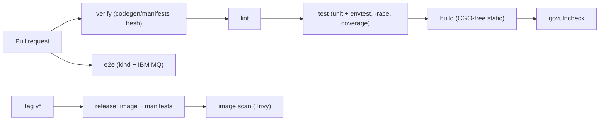

# CI/CD

This document describes the continuous integration and delivery design for the
IBM Message Queue Operator. The guiding principle: **the same checks run locally
(via Task and pre-commit) and in CI**, so "green locally" means "green in CI".

CI runs on **GitHub Actions**. Workflows land with the Phase 1 scaffold
([ROADMAP.md](ROADMAP.md)); this doc is the contract they implement.

## Principles

- **Parity**: every CI step maps to a `task` target. No bespoke CI-only logic.
- **Fail fast, fail loud**: lint, codegen drift, test failures, and vuln
  findings all block merge.
- **Reproducible**: tools pinned via `go.mod` `tool` directives; GitHub Actions
  pinned to commit SHAs; `go.sum` committed.
- **Cheap things often, expensive things deliberately**: unit/envtest on every
  PR; e2e and image scans on PRs touching relevant paths or on a schedule.
- **Least privilege**: workflows request only the permissions they need;
  registry/release credentials are scoped and only used on protected refs.

## Pipeline overview

## Triggers

| Event | Runs |
|-------|------|
| PR / push to default branch | `verify`, `lint`, `test`, `build`, `govulncheck`, `e2e` |
| Tag `v*` | `release` (build + push image, publish install manifests) + image scan |
| Schedule (e.g. weekly) | `govulncheck`, image scan, dependency bot |

## Jobs

### `verify`
Regenerates CRDs, RBAC, deepcopy, and mocks and fails on any diff
(`task verify`). Guarantees committed generated artifacts never drift.

### `lint`
`task lint` — golangci-lint v2 (`default: none`, curated linter set per
[AGENTS.md](../AGENTS.md)) plus `gofmt`/`goimports`/`golines`. Fails on any
finding or formatting diff.

### `test`
`task test:run` — Ginkgo unit + envtest with the race detector and a coverage
profile. envtest control-plane binaries come from `setup-envtest` (pinned K8s
API version). Coverage is uploaded as an artifact / summary; a regression is
investigated, not ignored.

### `build`
`task build` — static `CGO_ENABLED=0` binary; later `task docker:build` for a
multi-arch (`amd64`/`arm64`) **distroless nonroot** image. On PRs the image is
built but not pushed.

### `govulncheck`
`govulncheck ./...` against code and dependencies. Runs on PRs and on a
schedule so newly disclosed CVEs surface even without code changes.

### `e2e`
Spins up the local platform (`hack/kind-cluster`: kind + ingress + cert-manager
+ IBM MQ) and runs `task test:e2e` (build tag `e2e`) to assert real MQSC objects
are created/updated/deleted. Heavier, so it may be path-filtered or scheduled.

### `release` (tags only)
Builds and pushes the controller image to the registry, generates pinned
install manifests (Kustomize), and attaches them to the GitHub Release. Runs
only on `v*` tags on protected refs.

### image scan
**Trivy** scans the built image for OS/dependency vulnerabilities; documented
false positives live in `.trivyignore` with a rationale comment. Critical/high
findings fail the job.

## Caching

- Go build and module cache keyed on `go.sum`.
- golangci-lint cache keyed on config + Go version.
- setup-envtest assets cached by K8s version.
- Docker layer cache for image builds.

## Security & supply chain

| Control | Mechanism |
|---------|-----------|
| Dependency vulns | `govulncheck` (PR + schedule) |
| Image vulns | Trivy scan on release image |
| Dependency freshness | **Renovate** (or Dependabot) PRs for Go modules, Actions, Dockerfile, Terraform |
| Pinned actions | GitHub Actions referenced by commit SHA |
| Minimal permissions | `permissions:` block per workflow; default read-only |
| Reproducible build | CGO-free, pinned toolchain, committed `go.sum` |
| Nonroot runtime | distroless nonroot base, read-only FS, dropped caps |

Optional hardening to add as the project matures: SBOM generation, image signing
(cosign), and SLSA provenance — deferred until there are external consumers (see
the cert-manager-scale practices we deliberately skip in [adr/](adr/)).

## Branch protection

The default branch requires: `verify`, `lint`, `test`, `build`, and
`govulncheck` to pass before merge. `e2e` is required when it runs. No direct
pushes to the default branch.

## Local equivalents

| CI job | Local command |
|--------|---------------|
| verify | `task verify` |
| lint | `task lint` |
| test | `task test:run` |
| build | `task build` |
| govulncheck | `govulncheck ./...` |
| e2e | `task cluster:up && task test:e2e` |

pre-commit runs `gofmt`/`goimports`, `golangci-lint`, and `task verify` so most
CI failures are caught before pushing.
