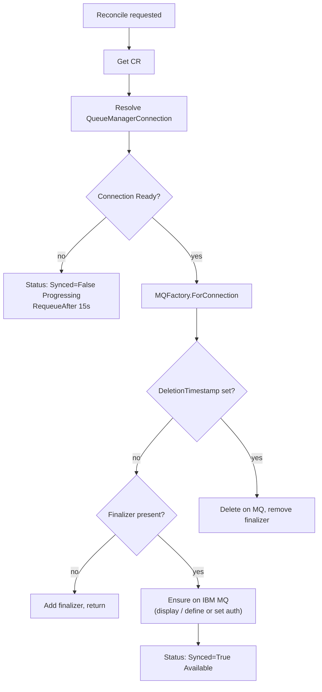

# Operator runtime

How the Kurator **controller-manager** process starts, registers controllers and
webhooks, talks to IBM MQ through a cached client factory, and reconciles each
custom resource kind. Module layout is in [GO_MODULE.md](GO_MODULE.md); CR
examples and security are in [ARCHITECTURE.md](ARCHITECTURE.md).

## Process bootstrap (`cmd/main.go`)

Startup order:

1. **Flags and env** — metrics/probe addresses, leader election, TLS cert paths
   for webhook and metrics, logging (`--log-config`, `KURATOR_LOG_*`), and
   `MaxConcurrentReconciles` (`--max-concurrent-reconciles` or
   `KURATOR_MAX_CONCURRENT_RECONCILES`, minimum 1).
2. **Logging** — `internal/logging` configures structured output (JSON in cluster).
3. **Scheme** — core Kubernetes types plus `messaging.kurator.dev/v1alpha1`.
4. **Manager** — controller-runtime `Manager` with metrics server (HTTPS + authz
   filter by default), webhook server, health probes, optional leader election
   (`LeaderElectionID`: `bdd44880.kurator.dev`).
5. **MQ factory** — `mqrest.NewClientFactory(mgr.GetClient())` implements
   `mqadmin.Factory`.
6. **Reconcilers** — six controllers, shared `events.EventRecorder` name
   `kurator-controller-manager`.
7. **Webhooks** — `webhookv1alpha1.SetupWithManager(mgr)` (validating only).
8. **Probes** — `healthz` ping; `readyz` via `health.NewMQConnectivityChecker`.
9. **Run** — `mgr.Start` on SIGTERM/SIGINT.

Nothing in `main` performs MQ work directly; it only wires dependencies.

## Reconciler registration

| Controller | Primary object | MQ via `Admin` |
|------------|----------------|----------------|
| `QueueManagerConnectionReconciler` | `QueueManagerConnection` | `Ping` |
| `QueueReconciler` | `Queue` | `Get/Define/DeleteQueue` |
| `TopicReconciler` | `Topic` | `Get/Define/DeleteTopic` |
| `ChannelReconciler` | `Channel` | `Get/Define/DeleteChannel` |
| `ChannelAuthRuleReconciler` | `ChannelAuthRule` | `Get/Set/DeleteChannelAuth` |
| `AuthorityRecordReconciler` | `AuthorityRecord` | `Get/Set/DeleteAuthority` |

All workload reconcilers share `setupMQObjectController` in
`internal/controller/reconcile_shared.go`: they **watch**
`QueueManagerConnection` and enqueue dependent CRs when connection readiness or
generation changes.

## Connection client cache

`mqrest.ClientFactory` (`internal/adapter/mqrest/factory.go`) implements
`mqadmin.Factory`:

- **`ForConnection`** — builds or returns a cached `mqadmin.Admin` (HTTPS
  `mqrest.Client`) for a `QueueManagerConnection`.
- **Cache key** — namespace/name, connection **generation**, credentials Secret
  **resourceVersion**, and optional CA Secret **resourceVersion**. Rotating
  Secrets or changing the connection spec invalidates the cache entry.
- **`ReleaseConnection`** — removes the cache entry when a connection CR is
  deleted (called from the QMC reconciler during finalizer removal).

The factory resolves `credentialsSecretRef` and optional `caSecretRef`, builds
TLS config (`insecureSkipVerify` opt-in), and parses `spec.endpoint` and
`spec.queueManager`. Credentials never appear in CR specs — only Secret refs.

Workload reconcilers obtain `admin` only after the connection is **Ready** (see
below).

## Reconcile flow (workload CRs)

`Queue`, `Topic`, `Channel`, `ChannelAuthRule`, and `AuthorityRecord` follow the
same skeleton (implemented per kind with shared helpers):

Steps in code (`internal/controller/*_controller.go` + `reconcile_shared.go`):

1. **Get** the CR; ignore `NotFound`.
2. **`connectionRefName`** / **`resolveConnection`** — load the named
   `QueueManagerConnection` in the same namespace.
3. **`waitForConnectionReady`** — if `Ready` is not True, patch `Synced=False`
   with reason `Progressing`, emit a Normal event on transition, return
   `RequeueAfter: 15s`.
4. **`MQFactory.ForConnection`** — terminal errors (missing Secret, bad endpoint)
   go through **`setSyncedError`**.
5. **Deletion** — if `deletionTimestamp` is set, run kind-specific
   `handleDeletion` (MQ delete, then remove finalizer).
6. **Finalizer** — add the kind finalizer constant from `api/v1alpha1` if missing;
   return and reconcile again.
7. **Ensure** — populate `status.desiredMQSC` via `mqrest.Format*MQSC`; call port
   methods to observe and converge MQ state. Drift behaviour for queues/topics/channels
   is in [ATTRIBUTE_RECONCILIATION.md](ATTRIBUTE_RECONCILIATION.md); auth kinds use
   GET/replace semantics documented there.
8. **Success** — `patchSyncedAvailable` sets `Synced=True`, `observedGeneration`,
   optional `lastSyncedTime`.

**Observe-only:** annotation `messaging.kurator.dev/drift-policy=observe-only`
reports drift without applying REPLACE/SET (see attribute doc).

## QueueManagerConnection reconcile

The connection reconciler does **not** use the shared workload skeleton:

1. On delete — `ReleaseConnection`, remove `QueueManagerConnectionFinalizer`.
2. On live object — add finalizer if needed.
3. Set `Ready=False`, reason `Progressing`, status update.
4. `ForConnection` + **`Ping`**.
5. On success — `Ready=True`, reason `Available`, `observedGeneration`; Normal
   event on transition to Available.
6. On failure — classified error on `Ready`; transient failures use
   `RequeueAfter: 30s` (see `queuemanagerconnection_controller.go`).

Readiness probe (`internal/health`): if there are zero QMCs, the operator is ready;
otherwise at least one connection must have `Ready=True`.

## Connection watch and fan-out

When a `QueueManagerConnection` becomes ready (or its spec generation changes),
`connectionEnqueueMapper` lists all workload CRs in the namespace that reference
that connection and enqueues reconcile requests for each. That avoids workloads
stuck behind a long `RequeueAfter` while only the QMC reconciler was running.

Predicates on the watch ignore updates that do not change readiness or generation.

## Finalizers

| Kind | Finalizer constant (API package) |
|------|----------------------------------|
| `QueueManagerConnection` | `QueueManagerConnectionFinalizer` |
| `Queue` | `QueueFinalizer` |
| `Topic` | `TopicFinalizer` |
| `Channel` | `ChannelFinalizer` |
| `ChannelAuthRule` | `ChannelAuthRuleFinalizer` |
| `AuthorityRecord` | `AuthorityRecordFinalizer` |

Finalizers ensure MQ objects are removed (or connection clients released) before
the CR disappears from etcd. Deletion sets `Synced=False`, reason `Deleting`, with
a Normal event on transition.

## Validating webhooks vs reconcile

| Concern | Webhooks (`internal/webhook`, `internal/validation`) | Reconcilers |
|---------|------------------------------------------------------|-------------|
| **When** | Admission (create/update/delete) | Async loop after persist |
| **MQ access** | Never | Via `mqadmin.Admin` |
| **Typical checks** | Required fields, names, same-namespace `connectionRef`, Secret refs exist for QMC, deny QMC delete if dependents exist | Connectivity, MQSC, drift, delete on QM |
| **Failure** | Request rejected (`failurePolicy: Fail`) | Status conditions + optional Events |

Webhooks keep invalid specs out of etcd; reconcilers converge valid specs against
a live Queue Manager. Do not duplicate MQ calls in webhooks.

## Status conditions and Kubernetes Events

**Conditions**

- `QueueManagerConnection`: `Ready` (connectivity).
- Workload CRs: `Synced` (object matches spec on MQ).

**Events** ([ADR-0015](adr/0015-kubernetes-events-on-transitions.md)) — emitted on
**transitions** only, implemented in `internal/controller/events.go`:

| Transition | Type | Typical reason |
|------------|------|----------------|
| Connection / object healthy | Normal | `Available` |
| Waiting on connection | Normal | `Progressing` |
| Deleting | Normal | `Deleting` |
| MQ object removed | Normal | `Deleted` |
| Terminal failure | Warning | `TerminalError.Reason`, `ConnectionNotFound`, … |
| Transient MQ/network | *(none)* | Status updated; requeue only |

`recordReconcileWarning` skips Events for `ErrTransient` to avoid noise during
retries.

## Error handling and requeue ([ADR-0014](adr/0014-mq-error-taxonomy-and-requeue.md))

Errors are classified in `mqrest` and returned as port types; reconcilers use
`errors.Is` / `errors.As` only.

| Class | Port signal | Reconciler behaviour |
|-------|-------------|-------------------|
| **Terminal** | `*TerminalError` (`ErrTerminal`) | `Synced` or `Ready` False with stable reason; Warning Event; no hot-loop |
| **Transient** | `*TransientError` (`ErrTransient`) | `setSyncedError` / QMC fail path returns `RequeueAfter: 30s` (workload) or connection equivalent |
| **NotFound** | `*NotFoundError` | Ensure: create path; Delete: treat as already gone |

Also handled without MQ types: Kubernetes `NotFound` on connection or Secret
(mapped to Warning reasons `ConnectionNotFound`, `SecretNotFound`).

Principles: wrap errors with context; never panic in reconcile; let
controller-runtime rate-limit when returning a bare error from `Reconcile`.

## Concurrency and metrics

- **`MaxConcurrentReconciles`** — global default applied to every controller via
  `controllerOptions()` (`internal/controller/options.go`).
- **Metrics** — each reconciler calls `metrics.RecordReconcile(controllerName, err)`
  after its inner reconcile.

## Operational flags (summary)

| Flag / env | Effect |
|------------|--------|
| `--leader-elect` | Single active manager replica |
| `--metrics-bind-address` | Prometheus (often `:8443` in deployment) |
| `--health-probe-bind-address` | `:8081` for `healthz` / `readyz` |
| `--max-concurrent-reconciles` / `KURATOR_MAX_CONCURRENT_RECONCILES` | Worker pool size per controller |
| Webhook / metrics cert paths | TLS for admission and metrics servers |

Full logging options: [LOGGING.md](LOGGING.md). NFR summary:
[NON_FUNCTIONAL_REQUIREMENTS.md](NON_FUNCTIONAL_REQUIREMENTS.md).

## See also

- [GO_MODULE.md](GO_MODULE.md) — packages, generated artifacts, test tiers
- [ARCHITECTURE.md](ARCHITECTURE.md) — component diagram, security, local kind topology
- [ATTRIBUTE_RECONCILIATION.md](ATTRIBUTE_RECONCILIATION.md) — DEFINE vs DISPLAY drift
- [IBM_MQ_REST_API.md](IBM_MQ_REST_API.md) — REST paths and CSRF header
