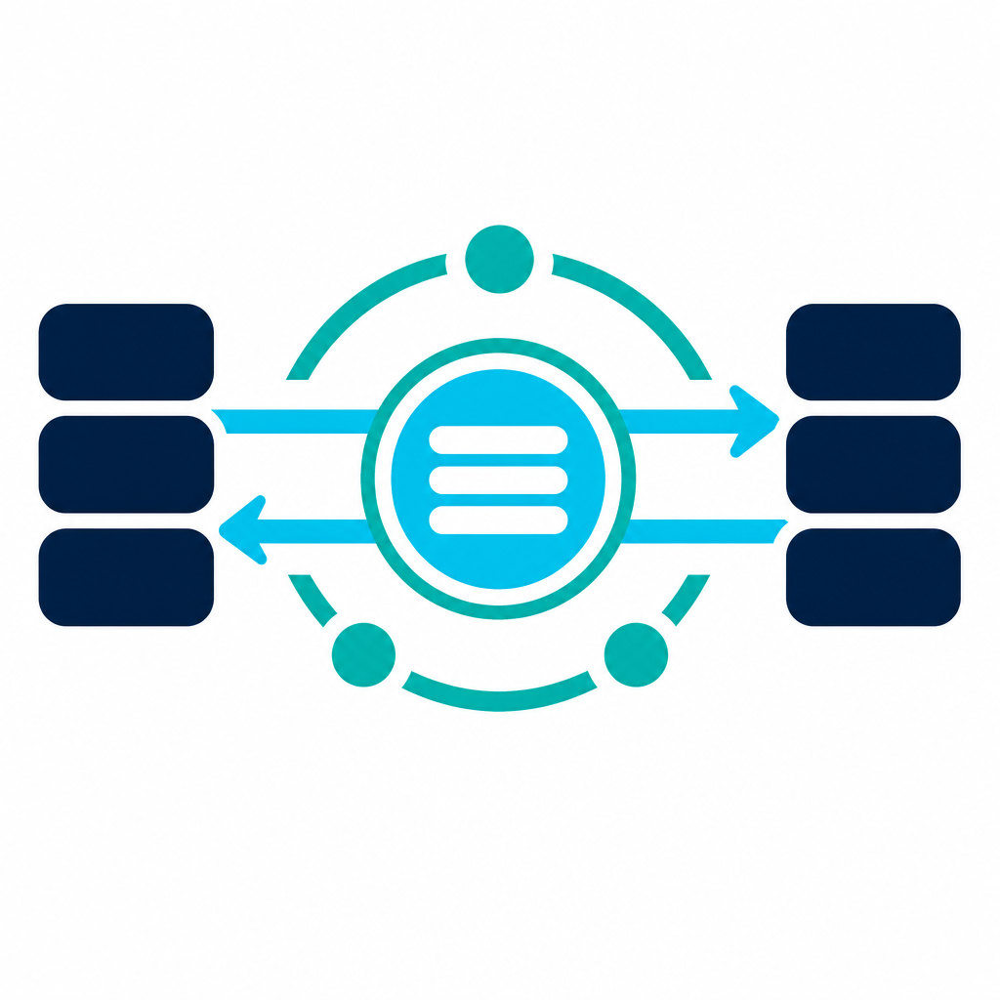

---
hide:
  - navigation
  - toc
  - title
---

<div class="mkurator-hero" markdown="1">

{ .mkurator-hero-logo }

<p class="mkurator-badges" markdown="1">

[](https://github.com/conduit-ops/MKurator/actions/workflows/ci.yaml)
[](https://github.com/conduit-ops/MKurator/actions/workflows/e2e.yaml)
[](https://github.com/conduit-ops/MKurator/actions/workflows/docs.yaml)
<br />
[](https://github.com/conduit-ops/MKurator/releases)
[](https://github.com/conduit-ops/MKurator/blob/main/LICENSE)
[](https://pkg.go.dev/github.com/conduit-ops/mkurator)
[](https://github.com/orgs/conduit-ops/packages?repo_name=MKurator)

</p>

**MKurator** is a Kubernetes operator that declaratively manages **IBM MQ administrative
objects** on an **existing queue manager** — queues, topics, channels, channel auth rules,
and authority records — via the mqweb REST API.

`messaging.mkurator.dev/v1alpha1` · event-driven · TLS-first · Helm-ready

[Quick start :octicons-arrow-right-24:](QUICKSTART.md){ .md-button .md-button--primary }
[Install guide :octicons-arrow-right-24:](INSTALL_AND_USE.md){ .md-button }

</div>

## What MKurator does

You declare desired MQ state in Kubernetes custom resources. The operator reconciles
that state against your queue manager through HTTPS mqweb, reports **conditions** on each
CR, and removes MQ objects when you delete a resource (finalizers).

MKurator does **not** install or scale queue managers — it connects to one you already run.

## How it works

```text
Custom Resource  →  controller reconcile  →  mqweb REST (MQSC)  →  IBM MQ Queue Manager
       ↑                                                              |
       └──────────── status conditions / Events ←──────────────────────┘
```

| Custom resource | MQ objects |
| --- | --- |
| `QueueManagerConnection` | Connectivity + credential reference |
| `Queue` | `QLOCAL`, `QALIAS`, `QREMOTE` |
| `Topic` | `TOPIC` |
| `Channel` | `CHLTYPE(SVRCONN)` |
| `ChannelAuthRule` | `SET CHLAUTH` |
| `AuthorityRecord` | `SET AUTHREC` (OAM) |

!!! info "v1alpha1 status"
    Phase 5 auth (`ChannelAuthRule`, `AuthorityRecord`) is shipped on `main`. Latest release:
    **v0.6.0**. See the [roadmap](ROADMAP.md) for remaining items.

## Documentation map

| Audience | Start here |
| --- | --- |
| Operators | [Install and use](INSTALL_AND_USE.md) · [Upgrade](UPGRADE.md) · [Observability](OBSERVABILITY.md) |
| Developers | [Development setup](DEVELOPMENT.md) · [Developer guide](DEVELOPER_GUIDE.md) · [CI/CD](CICD.md) |
| Architects | [Architecture](ARCHITECTURE.md) · [Attribute reconciliation](ATTRIBUTE_RECONCILIATION.md) · [ADRs](adr/README.md) |
| Contributors | [Contributing](https://github.com/conduit-ops/MKurator/blob/main/CONTRIBUTING.md) · [Code of Conduct](https://github.com/conduit-ops/MKurator/blob/main/CODE_OF_CONDUCT.md) · [Governance](https://github.com/conduit-ops/MKurator/blob/main/GOVERNANCE.md) |

## Examples

- [Queue and connection walkthrough](examples/queue-and-connection.md)
- [Channel authentication](examples/channel-authentication.md)
- [Upgrade walkthrough](examples/upgrade-walkthrough.md)

Sample YAML with field notes: [config/samples README](https://github.com/conduit-ops/MKurator/blob/main/config/samples/README.md).
