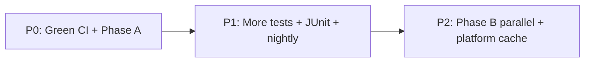

# Test and CI/CD expansion plan

**Status:** Design / analysis only (no workflow or test implementation in this change).  
**Date:** 2026-06-03  
**Scope:** Test pyramid gaps, GitHub Actions automation, branch protection alignment.  
**Inputs:** [DEVELOPMENT.md](../DEVELOPMENT.md), [CICD.md](../CICD.md), [AGENTS.md](../../AGENTS.md), [ROADMAP.md](../ROADMAP.md#later--candidate-work), [E2E_SPEEDUP_PROPOSAL.md](./E2E_SPEEDUP_PROPOSAL.md), [DELTA_AUDIT_2026-06-03.md](./DELTA_AUDIT_2026-06-03.md).

---

## Executive summary

Kurator already runs a **four-tier pyramid** (unit + envtest, Docker integration, kind e2e) with strong **local/CI parity** via Task. Gaps cluster in three areas: **(1)** contract and admission depth for deferred CHLAUTH types, **(2)** envtest/e2e coverage of Kubernetes Events and upgrade paths, and **(3)** CI ergonomics (fail-fast, reusable workflows, nightly signal, release gates) while e2e remains **time- and flake-bound**.

**Highest leverage before adding scenarios:** stabilize green CI ([DELTA_AUDIT](./DELTA_AUDIT_2026-06-03.md)), then apply **E2E Phase A** (single deploy, fixture once, webhook readiness cache) — that unlocks headroom for more specs without new workflows ([E2E_SPEEDUP](./E2E_SPEEDUP_PROPOSAL.md)).

---

## Current baseline (as of 2026-06-03)

| Layer | Location | CI / local | Notes |
|-------|----------|------------|-------|
| Unit + httptest | `internal/**`, `internal/adapter/mqrest/*_test.go` | `task test:run` in `ci.yaml` `test` | **≥90%** `internal/` floor in `Taskfile.test.yml`; race enabled |
| envtest | `internal/controller/*_test.go`, `internal/webhook/v1alpha1/suite_test.go` | same | Webhooks, QMC delete-with-dependents (validation); `MQAdmin` mocked |
| Integration | `test/integration/mq/` (`//go:build integration`) | `integration.yaml` | Queue/topic/channel, alias/remote, CHLAUTH ADDRESSMAP/BLOCKUSER, AUTHREC queue principal; Docker MQ |
| e2e | `test/e2e/` (`//go:build e2e`) | `e2e.yaml` | Manager smoke + MQ reconcile; Helm job on `main` / `workflow_dispatch` only |
| Helm static | `task helm:lint` + `hack/helm-verify-*.sh` | `ci.yaml` `helm-lint` | Admission + ClusterRole drift vs Kustomize |
| Supply chain | `release.yaml` | tags `v*` | Trivy CRITICAL/HIGH, cosign, BuildKit + SPDX SBOM |

**Not in CI today:** scheduled nightly e2e, Helm e2e on every PR, upgrade smoke, OPA/conftest, helm-unittest, OpenSSF Scorecard, license scan beyond release SBOM, Ginkgo JUnit artifacts, `workflow_call` reuse, merge queue.

**Codecov:** `codecov.yml` uses `target: auto` only — upload fails CI (`fail_ci_if_error: true`) but **no coverage regression gate**.

---

## A. Additional test types (by layer)

### A.1 Contract and schema tests

| Idea | What to add | Effort | Value |
|------|-------------|--------|-------|
| CRD OpenAPI snapshot | Golden files under `config/crd/bases/` or `docs/schemas/`; `task verify` or dedicated `task test:schema` diffs generated CRD YAML / OpenAPI fragments | S | Catches kubebuilder marker drift without a cluster |
| `kubectl explain` golden | Script records `kubectl explain <kind>.spec` for each CRD after `task install:crds` on envtest cluster; fail on unexpected diff | S | User-facing contract documentation |
| mqweb MQSC schema | Extend [`docs/schemas/mqsc-runcommand.schema.json`](../schemas/mqsc-runcommand.schema.json); optional validate generated MQSC strings in unit tests | M | Aligns REST/MQSC with IBM contract |
| Swagger pin | ROADMAP item: commit `docs/schemas/mqweb-swagger.json` per MQ version; diff on bump | M | REST adapter contract |

**Existing:** CRD validation via kubebuilder markers; `task verify` for controller-gen output; IBM_MQ_OBJECTS.md mentions golden MQSC files (not automated).

### A.2 Admission validation expansion

| Idea | What to add | Effort | Value |
|------|-------------|--------|-------|
| Table-driven negatives | `internal/validation/*_test.go`: USERMAP without `clientUser`, SSLPEERMAP without `sslPeer`, QMGRMAP/BLOCKADDR field combos (schema allows enum today; MQSC deferred per [PHASE5_AUTH_SKETCH](../PHASE5_AUTH_SKETCH.md)) | S | Fast guardrails before USERMAP API lands |
| envtest webhook paths | Mirror new validation rules in `internal/webhook/v1alpha1/suite_test.go` (pattern: unknown-attribute warnings, CAR-without-Channel) | S | End-to-end admission without MQ |
| e2e negative applies | Extend `test/e2e/e2e_test.go` (invalid Queue, CAR without Channel) with USERMAP/SSLPEERMAP invalid specs once fields exist | M | Proves Helm + Kustomize webhook parity |

**Existing:** `TestValidateChannelAuthRuleSpec*` (ADDRESSMAP, BLOCKUSER, BLOCKADDR); QMC delete blocked when auth dependents exist (unit + envtest); e2e webhook denial specs.

### A.3 mqrest httptest (adapter unit)

| Idea | What to add | Effort | Value |
|------|-------------|--------|-------|
| CHLAUTH MQSC per rule type | Table tests in `auth_test.go` for USERMAP, SSLPEERMAP, QMGRMAP, BLOCKADDR (fields TBD on CRD); today only ADDRESSMAP + BLOCKUSER have golden strings | S–M | Safe before live MQ for deferred types |
| AUTHREC object types | Golden `buildSetAuthorityMQSC` for CHANNEL, TOPIC, QMGR, NAMESPAC, PROCESS, NLIST (`mqadmin.AuthorityObjectType*`) | S | Integration only exercises QUEUE today |
| Error taxonomy | Extend `client_test.go` httptest for auth CHLAUTH/AUTHREC AMQ codes → `ErrNotFound` / terminal | S | Matches [ADR-0014](../adr/0014-mq-error-taxonomy-and-requeue.md) |

**Existing:** `auth_test.go`, `client_test.go` auth paths; `buildSetChannelAuthMQSC` is generic (any `RuleType` string) but not golden-tested beyond two types.

### A.4 Integration (Docker MQ)

| Idea | What to add | Effort | Value |
|------|-------------|--------|-------|
| AUTHREC object types | `TestIntegration_GetAuthority_*` for CHANNEL, TOPIC, group-based AUTHREC | M | Fills gap vs e2e (single queue principal) |
| Observe-only auth | Reconcile authority/CHLAUTH with drift policy annotation — **controller** path covered in unit (`drift_policy_test.go`, `channelauthrule_reconciler_test.go`); add integration only if mqrest GET/SET semantics need proof | S–M | Optional; unit may suffice |
| Delete ordering | Explicit test: delete queue before AUTHREC vs AUTHREC before queue; CHLAUTH before channel delete | M | Documents cleanup semantics for finalizers |
| Extended CHLAUTH types | Live MQ SET/GET for USERMAP/SSLPEERMAP when API fields ship | M | Depends on product decision |
| CHLAUTH types in CI | No change to workflow; extend `auth_integration_test.go` only | — | Keeps `integration.yaml` duration stable |

**Existing:** CRUD, replace-on-update, idempotent delete, not-found for auth; alias/remote queues in `client_integration_test.go`.

### A.5 envtest (controller + API)

| Idea | What to add | Effort | Value |
|------|-------------|--------|-------|
| events.k8s.io | Controllers use `events.EventRecorder` + RBAC `events.k8s.io` ([`events.go`](../../internal/controller/events.go)); unit tests use `FakeRecorder`. Add envtest: apply CR, assert Event with reason `Available` / `DriftDetected` / `Progressing` | M | Closes gap noted in audit; e2e has `events_helpers.go` but Manager suite may not assert Events API version |
| QMC delete with dependents | envtest suite already denies delete with Queue/Topic/Channel/CAR/AuthorityRecord — add **reconciler-level** test: finalizer removal only after dependents gone | S | Complements webhook-only validation |
| Multi-reconciler stress | Low-priority: many CRs, one mocked `Admin`, assert queue depth / no hot loop | L | Performance precursor |

**Existing:** `suite_test.go` webhook tests; `wiring_envtest_test.go` registers all reconcilers; `events_test.go` unit tests for classify/record.

### A.6 Upgrade tests

| Idea | What to add | Effort | Value |
|------|-------------|--------|-------|
| Helm upgrade --install | Script or Ginkgo job: install chart `vN-1` from release asset, upgrade to current `IMG`, assert CRs + webhooks healthy | L | [UPGRADE.md](../UPGRADE.md) order: CRDs → operator |
| CRD migration | Apply old `install-crds.yaml` from previous tag, upgrade CRDs, server-side apply sample CRs — no data loss | L | Run on release branch or nightly only |
| cert-manager / webhook CA rotation | Optional smoke after upgrade | L | High flake; document manual check first |

**Not present** in repo; release docs describe manual smoke only ([RELEASE.md](../RELEASE.md)).

### A.7 Chaos and resilience (light scope)

| Scenario | Suggested tier | Effort | Notes |
|----------|----------------|--------|-------|
| mqweb down / 503 | Integration: httptest or short Docker test with proxy kill | M | Assert requeue, not terminal |
| Credential rotation | e2e: QMC spec secret change (partially in mq_e2e) | S | Extend with invalid cred recovery |
| QM pod restart | kind only; label `slow` | L | Defer until e2e Phase A green |
| Network partition | — | — | **Defer** (flaky on GHA) |

Keep chaos **out of PR-required** paths; optional nightly or manual `workflow_dispatch`.

### A.8 Performance / load (optional)

| Idea | Tier | Effort |
|------|------|--------|
| Reconcile latency histogram | Unit benchmark or envtest with fake clock | M |
| Many CRs vs one QMC | e2e with `KURATOR_MAX_CONCURRENT_RECONCILES` | L |
| mqweb rate limit | Integration with burst applies | L |

NFR PERF-3 documents concurrency flag; no automated perf gate today.

### A.9 Helm chart tests

| Tool | Purpose | Effort |
|------|---------|--------|
| [helm-unittest](https://github.com/helm-unittest/helm-unittest) | Assert template snippets: webhook Service, ClusterRole verbs, probes, env | M |
| [chart-schema](https://github.com/kubesail/chart-schema) or `values.schema.json` | Validate `values.yaml` types | S |
| Existing `hack/helm-verify-*.sh` | Keep as drift gate vs Kustomize | — |

CI already runs `task helm:lint`; unittest would be a new `task helm:test` wired into `helm-lint` job or separate fast job.

### A.10 Policy tests (samples)

| Idea | Mechanism | Effort |
|------|-----------|--------|
| OPA / conftest | Rego policies on `charts/kurator/samples/resources/*.yaml` and `config/samples/` — require `connectionRef`, forbid `insecureSkipVerify` in prod-like labels | M |
| Kyverno (optional) | ClusterPolicy examples in docs only | L |

Aligns with security NFRs; no cluster required for conftest.

### A.11 Supply chain tests (beyond release Trivy)

| Control | Today | Expansion |
|---------|-------|-----------|
| Image vulns | Trivy on tag | Add PR scan of `task docker:build` digest (slow) or weekly |
| SBOM | BuildKit + `sbom-action` on release | Attach to PR artifacts for main-only builds |
| License compliance | Not automated | `go-licenses` or `syft` license summary in CI; fail on denied licenses |
| cosign verify | Documented in RELEASE.md | **Install smoke workflow**: pull release image, `cosign verify`, `kubectl apply` dry-run |
| OpenSSF Scorecard | P2 in [ADR-0005](../adr/0005-keep-tooling-lean.md), [DELTA_AUDIT](./DELTA_AUDIT_2026-06-03.md) | Scheduled `ossf/scorecard-action`; fix follow-ups incrementally |

---

## B. CI/CD automation improvements

### B.1 Required checks matrix

| Event | Required today ([CICD.md](../CICD.md)) | Recommended |
|-------|----------------------------------------|-------------|
| PR → `main` (code paths) | 7× `ci.yaml` + `integration` + `e2e (kustomize)` | Same; add optional `verify-fast` as first gate |
| PR → `main` (docs-only) | 7× `ci.yaml` only | Document that integration/e2e are skipped via `paths-ignore` |
| Push → `main` | Above + `e2e (helm)` | Keep Helm on `main`; consider **nightly** for full Helm if Phase C moves PR to kustomize-only |
| Tag `v*` | `release.yaml` only (no test rerun) | **Release gate:** require workflow success on tagged SHA (see B.8) |

**Legacy cleanup:** Remove branch protection entries `format`, `govulncheck` if still present.

### B.2 Reusable workflows (`workflow_call`)

Extract from `ci.yaml`:

```yaml
# .github/workflows/reusable-verify-lint-test.yaml (conceptual)
on:
  workflow_call:
jobs:
  verify: ...
  lint: ...
  test: ...
```

Caller: `ci.yaml` becomes thin orchestrator; future `nightly.yaml` or `release-gate.yaml` reuses same jobs. **Benefit:** one place to bump Go/Task pins; **cost:** initial refactor + pass secrets (Codecov) via `secrets: inherit`.

### B.3 Merge queue and concurrency

| Knob | Current | Suggestion |
|------|---------|------------|
| e2e/integration concurrency | Per-ref group; cancel PR in-flight | Keep; enable **merge queue** on `main` only if e2e duration drops (Phase A) |
| `ci.yaml` | No concurrency | Optional `cancel-in-progress: true` for PRs on verify/lint only |
| Machine lock | Local `exclusive-test.lock` | Unchanged; CI uses separate runners |

### B.4 Nightly workflow (new)

Single scheduled workflow (e.g. Mon 03:00 UTC):

1. `task ci:integration` (or reuse integration job)
2. `task ci:e2e` with `KURATOR_E2E_MQ=1`
3. `KURATOR_E2E_DEPLOY=helm task test:e2e` on same cluster (Phase C pattern — one `cluster:up`)
4. Renovate `dry-run` or `renovate-config-validator` (optional)
5. Upload logs + JUnit as artifacts

**Purpose:** flake detection without blocking PRs; satisfies audit item “scheduled nightly e2e”.

### B.5 PR path filters (fine-tuning)

Current `paths-ignore` on integration/e2e: `**.md`, `docs/**`, `charts/**/README.md`.

| Change | Rationale |
|--------|-----------|
| Include `docs/schemas/**`, `api/**`, `config/crd/**` as **triggers** even under `docs/` | Schema/API doc edits affect contracts |
| Ignore `docs/plans/**` only | Planning docs should not skip e2e when code unchanged — **optional** |
| Trigger integration on `hack/mq-docker/**`, `test/integration/**` only | Split workflow — **only if** integration job needs to shrink |

Avoid over-filtering: false negatives (merged broken CRD) hurt more than extra CI minutes.

### B.6 Fail-fast job (~2 min target)

New job `preflight` (or `verify-fast`) running **before** or **in parallel** with heavy jobs:

```sh
go mod tidy && git diff --exit-code go.mod go.sum
task verify   # or split: mockery + controller-gen only
```

Optional: `task format:check` only on changed `.go` files (path filter from `dorny/paths-filter`). **Goal:** catch Renovate `go.sum` drift ([DELTA_AUDIT](./DELTA_AUDIT_2026-06-03.md)) before 30 min integration/e2e.

### B.7 Test report artifacts

| Output | How |
|--------|-----|
| Ginkgo JUnit | `go test -tags=e2e ./test/e2e/... -ginkgo.junit-report=e2e-junit.xml` (Ginkgo v2 flag) |
| Unit JUnit | `ginkgo -r` with junit report or `gotestsum --junitfile` |
| Publish | `actions/upload-artifact` + optional `EnricoMi/publish-unit-test-result-action` for PR annotations |

Today: `-ginkgo.github-output` in CI only; no persisted report.

### B.8 Flake detection (e2e retry policy)

| Policy | Scope |
|--------|-------|
| **No retry** on PR e2e | Fails loud; fix root cause |
| **1 retry** on nightly only | `hack/ci/run-e2e.sh` wrapper with `GINKGO_FLAKE_ATTEMPTS=2` |
| Track flakes | Parse JUnit for “intermittent” label specs |

Do not enable PR retries by default — masks deploy/readiness bugs (metrics, Helm BeforeAll).

### B.9 Release gate (SHA must be green)

Today maintainers manually confirm CI before tag ([CICD.md](../CICD.md), [RELEASE.md](../RELEASE.md)).

Automate:

1. `workflow_dispatch` “Prepare release” on SHA **or** tag push triggers `release-gate` job
2. `gh api repos/.../commits/{sha}/check-runs` — require success: `verify`, `lint`, `test`, `integration`, `e2e (kustomize)` (and optionally `e2e (helm)` on `main`)
3. `release.yaml` `workflow_run` dependency or reusable workflow — **block** image push if red

**v0.5.2 lesson ([DELTA_AUDIT](./DELTA_AUDIT_2026-06-03.md)):** tag without green e2e → document gate in RELEASE checklist.

### B.10 cosign verify in install smoke CI

New workflow `smoke-release.yaml` (monthly or post-release):

- Download `install.yaml` + image digest from latest release
- `cosign verify` per RELEASE.md
- `kubectl apply --dry-run=server` or kind apply with `--image` override

Validates supply-chain docs, not operator logic.

### B.11 Pre-release Helm e2e on schedule only

Align with [E2E_SPEEDUP Phase C](./E2E_SPEEDUP_PROPOSAL.md): PR runs kustomize; **Helm e2e** on nightly + `main` push (already partial). Drop second full `cluster:up` on `main` by sequential kustomize then helm on one kubeconfig.

### B.12 Docker layer cache (integration MQ)

| Approach | Applies to |
|----------|------------|
| `actions/cache` on IBM MQ image tarball / `docker pull` save | `integration.yaml`, `e2e.yaml` |
| Pre-pull service in self-hosted pool | Optional P2 |

[CICD.md](../CICD.md) explicitly notes no Docker layer cache today — platform time dominates.

### B.13 Self-hosted runner for e2e (optional P2)

- Persistent kind cluster + MQ → amortize `cluster:up` ([E2E_SPEEDUP](./E2E_SPEEDUP_PROPOSAL.md) platform savings)
- **Costs:** runner hygiene, lock semantics, security boundary
- **Defer** until GHA duration still blocks after Phase A+C

### B.14 Branch protection → GitHub settings checklist

Maintain in [CICD.md](../CICD.md) or link here:

- [ ] Require PR before merge to `main`
- [ ] Require status checks: `gitleaks`, `verify`, `lint`, `test`, `build`, `docker-build`, `helm-lint`, `integration`, `e2e` (exact names from workflow `jobs.<id>.name`)
- [ ] Require branches up to date (or merge queue)
- [ ] Do not allow bypassing required checks
- [ ] Restrict push to `main` (maintainers only)
- [ ] Optional: require `preflight` when added
- [ ] Tag protection: restrict who can create `v*` tags; prefer release workflow only after gate

---

## C. Prioritized roadmap

Effort: **S** ≤1 day, **M** 2–5 days, **L** >1 week.  
**E2E unlock:** items that free wall-clock for more specs without new MQ infrastructure.

### P0 — CI integrity and release truth (do first)

| # | Item | Effort | Unlocks |
|---|------|--------|---------|
| 1 | Fix `go.sum` / `go tool kustomize` in Integration ([DELTA_AUDIT](./DELTA_AUDIT_2026-06-03.md)) | S | Trustworthy integration signal |
| 2 | Green e2e kustomize + Helm on `main` (metrics readiness, `deploy_helpers` Helm path) | M | Meaningful nightly and release gate |
| 3 | **E2E Phase A:** single operator deploy, fixture once, webhook readiness cache ([E2E_SPEEDUP](./E2E_SPEEDUP_PROPOSAL.md)) | M | **~15–25 min** suite savings → **~10+ similar MQ specs** in 90 min budget |
| 4 | `preflight` job: `go mod tidy` + `task verify` | S | Fail in &lt;5 min on codegen/sum drift |
| 5 | Align ROADMAP / CHANGELOG with CI reality before next tag | S | Process |

### P1 — High-value tests and CI ergonomics

| # | Item | Effort | E2E tie-in |
|---|------|--------|------------|
| 6 | mqrest httptest goldens for all CHLAUTH types + AUTHREC object types | S–M | Moves cases off e2e per Phase C pyramid |
| 7 | Admission tables for USERMAP/SSLPEERMAP negatives (schema-era) | S | — |
| 8 | Integration: AUTHREC CHANNEL/TOPIC/group; delete ordering | M | Reduces need for duplicate e2e auth variants |
| 9 | envtest: assert `events.k8s.io` Events on reconcile transitions | M | Can drop some e2e event polling |
| 10 | Ginkgo JUnit artifacts + job summary | S | Debug flakes faster → shorter retry cycles |
| 11 | Nightly workflow: full e2e + helm + integration | M | Flake stats without blocking PRs |
| 12 | Reusable `workflow_call` for verify/lint/test | M | Easier nightly/release-gate |
| 13 | Release gate job on SHA | M | Prevents tag-ahead-of-green |
| 14 | **E2E Phase B:** parallel namespaces + unique MQ prefixes | M–L | **~50% suite** cut → **2× spec capacity** on warm cluster |
| 15 | helm-unittest for chart templates | M | — |
| 16 | conftest on sample manifests | M | — |

### P2 — Backlog / optional

| # | Item | Effort | Notes |
|---|------|--------|-------|
| 17 | Upgrade test job (Helm + CRD migration) | L | Nightly or release-candidate only |
| 18 | OpenSSF Scorecard scheduled | S | [DELTA_AUDIT](./DELTA_AUDIT_2026-06-03.md) P2 |
| 19 | License scan (`go-licenses` / syft) | M | Complements Trivy |
| 20 | Docker image cache for IBM MQ | M | Platform −3–8 min ([E2E_SPEEDUP](./E2E_SPEEDUP_PROPOSAL.md)) |
| 21 | PR Trivy on built image | M | Noisy; weekly may suffice |
| 22 | cosign install smoke workflow | S | Docs validation |
| 23 | Codecov strict floor (e.g. 90% project) | S | Matches local `task test:run` |
| 24 | Self-hosted runner pool | L | Only if Phase A+C insufficient |
| 25 | Chaos suite (mqweb down) | M | Nightly label `chaos` only |
| 26 | Perf / load benchmarks | L | — |
| 27 | USERMAP API + integration + e2e | L | Product-dependent |
| 28 | PCF adapter tests | L | Scaffold only today |

### E2E speedup alignment (summary)



| E2E phase | Test expansion enabled |
|-----------|-------------------------|
| **Phase A** | More serial MQ specs (auth variants, observe-only e2e, extra webhook negatives) within same job |
| **Phase B** | Parallel queue/topic/channel families; serial `mq-auth-serial` lane for CHLAUTH |
| **Phase C** | Shift adapter-heavy cases to integration; e2e = smoke per CR kind |

---

## What not to do yet

Wait until **P0 is green** and **E2E Phase A** is merged before investing in: **parallel Ginkgo nodes (Phase B)**, **self-hosted runners**, **broad chaos/resilience suites**, **PCF integration/e2e**, **PR-required image Trivy on every push**, and **OpenSSF Scorecard gating** (run informational first). Adding e2e retries on PRs would hide deploy/readiness defects documented in [DELTA_AUDIT](./DELTA_AUDIT_2026-06-03.md).

---

## References

| Artifact | Path |
|----------|------|
| CI workflows | [`.github/workflows/`](../../.github/workflows/) |
| Test tasks | [`Taskfile.test.yml`](../../Taskfile.test.yml), [`Taskfile.yml`](../../Taskfile.yml) (`ci:e2e`, `ci:integration`) |
| E2e runner | [`hack/ci/run-e2e.sh`](../../hack/ci/run-e2e.sh) |
| Branch protection | [CICD.md § Branch protection](../CICD.md#branch-protection) |
| Codecov | [`codecov.yml`](../../codecov.yml) |
| Coordination | [`hack/.agent-coordination.json`](../../hack/.agent-coordination.json) (`push_allowed: false` at doc authoring) |

---

## Deliverable summary (for parent agent)

| Item | Value |
|------|-------|
| **Doc path** | `docs/plans/TEST_AND_CICD_EXPANSION.md` |
| **Push** | Not pushed (`push_allowed: false`) |

### Top 5 test additions

1. **mqrest httptest goldens** for every CHLAUTH rule type and AUTHREC `OBJTYPE` (today: ADDRESSMAP/BLOCKUSER + QUEUE only).
2. **Integration:** AUTHREC for non-QUEUE types, group principal, and explicit delete-ordering cases.
3. **envtest:** assert real **`events.k8s.io`** Events on reconcile (Available / DriftDetected / Deleting).
4. **Admission table expansion** for USERMAP/SSLPEERMAP (and BLOCKADDR) negative paths ahead of MQSC implementation.
5. **Contract tests:** CRD OpenAPI / `kubectl explain` golden snapshots in `task verify` or dedicated schema task.

### Top 5 CI improvements

1. **`preflight` fail-fast job** — `go mod tidy` + `task verify` in minutes (catches Renovate/go.sum drift).
2. **E2E Phase A in suite** (single deploy, fixture once) — largest unlock for more tests in same 90 min job.
3. **Nightly workflow** — full integration + kustomize e2e + Helm on one cluster; flake metrics without blocking PRs.
4. **Automated release gate** — block tag/release unless required check-runs are green on the exact SHA.
5. **Ginkgo JUnit artifacts** (and optional PR test report) for faster diagnosis of e2e/integration failures.

### One sentence: what not to do yet

Do not add parallel e2e, self-hosted runners, chaos suites, or Scorecard merge gates until Integration and e2e are reliably green and Phase A deploy deduplication is in place.
