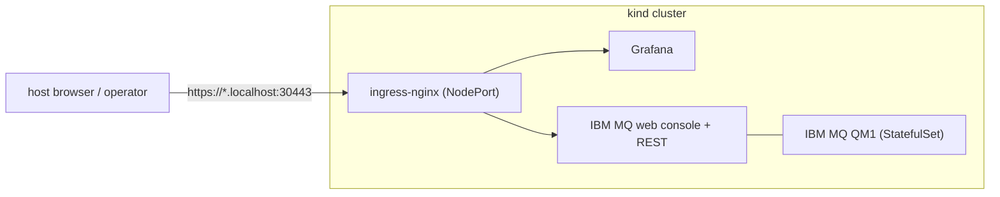

# Local kind dev cluster

A one-command local environment for developing and testing the IBM Message
Queue Operator. It provisions a [kind](https://kind.sigs.k8s.io/) cluster and,
via Terraform + Helm, installs:

- **ingress-nginx** (NodePort 30080/30443, mapped to the host) as the ingress
  controller. `nginx` is required because the IBM MQ chart's web-console
  Ingress hardcodes that class.
- **cert-manager** (for future operator webhook certificates).
- **kube-prometheus-stack** (Prometheus + **Grafana**), optional.
- **IBM MQ** queue manager (`QM1`) from the vendored [`charts/ibm-mq`](charts/ibm-mq)
  chart, with the web console + administrative REST API enabled. This is the
  *target* the operator manages; the operator does not deploy MQ in production.

TLS for all ingresses uses a [mkcert](https://github.com/FiloSottile/mkcert)
wildcard certificate for `*.localhost`.



## Prerequisites

- A container runtime: Docker (recommended), nerdctl, or Podman
- [`kind`](https://kind.sigs.k8s.io/), [`kubectl`](https://kubernetes.io/docs/tasks/tools/),
  [`helm`](https://helm.sh/), [`terraform`](https://developer.hashicorp.com/terraform),
  [`mkcert`](https://github.com/FiloSottile/mkcert), and [`task`](https://taskfile.dev)

## Usage

From the repository root:

```sh
task cluster:up      # create cluster, generate TLS, apply Terraform, print info
task cluster:info    # re-print access URLs and credentials
task cluster:cleanup # terraform destroy (keeps the kind cluster)
task cluster:down    # destroy everything incl. the kind cluster and local state
```

You can also run tasks directly from this directory with `task -d hack/kind-cluster up`.

## Access (after `task cluster:up`)

| What | URL | Credentials |
|------|-----|-------------|
| IBM MQ web console | https://mq.localhost:30443/ibm/mq/console/ | `admin` / `passw0rd` |
| IBM MQ admin REST API | https://mq.localhost:30443/ibm/mq/rest/v2/admin/qmgr | `admin` / `passw0rd` |
| Grafana | https://grafana.localhost:30443/ | `admin` / `admin` |

In-cluster, the operator should target the queue manager at
`https://ibm-mq.ibm-mq.svc:9443` (set as `QueueManagerConnection.endpoint`).

Override defaults with Terraform variables (e.g. `mq_admin_password`,
`grafana_admin_password`, `enable_monitoring=false`) via `TF_VAR_*` env vars or
by editing the apply step.

## Notes

- The IBM MQ image uses the **IBM MQ Advanced for Developers** license, which
  this environment accepts (`license: accept`) for local development only.
- State (kubeconfig, mkcert certs, Terraform state) is kept under `.state/` and
  is git-ignored.
- `charts/ibm-mq` is vendored from the upstream IBM MQ Helm chart (Apache-2.0)
  and is intentionally left unmodified; dev-specific settings live in
  [`terraform/ibm-mq.tf`](terraform/ibm-mq.tf).
